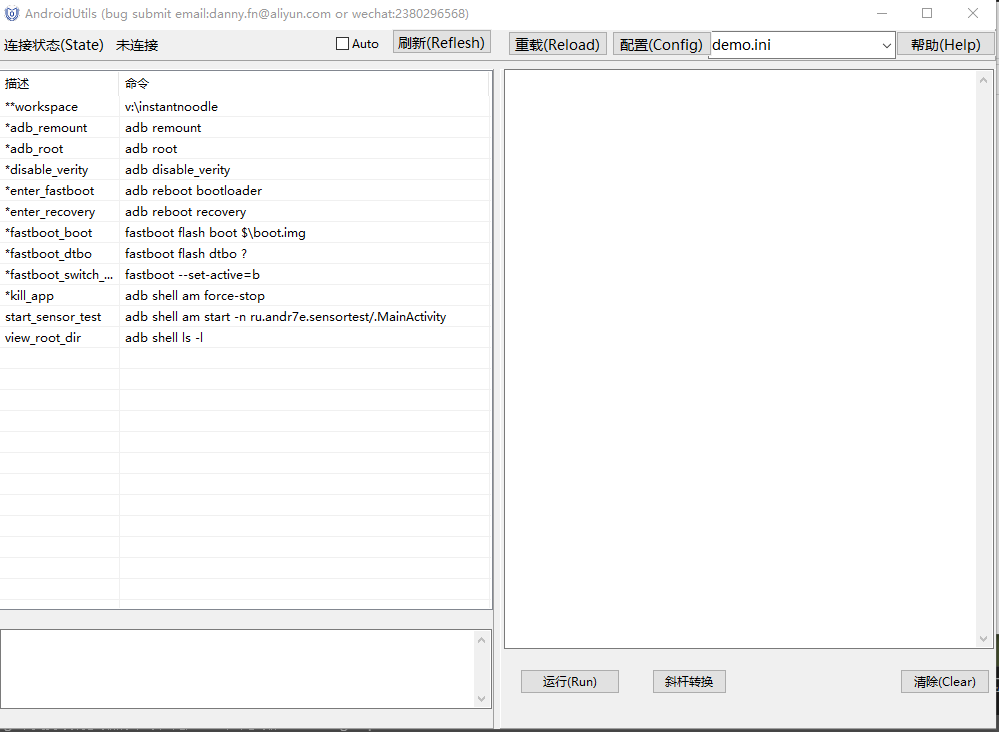

# androidutils-config

## 界面使用
* 刷新: 点击刷新button, 刷新连接状态。  
* Auto：自动刷新连接状态。  
* 重载: 重新加载配置命令文件。  
* 配置: 编辑命令配置文件。  
* 下拉列表: 切换命令配置文件。 
* 运行: 运行命令,可在命令框内自由编辑。  
* 清除: 清除日志框。  
* 斜杆转换: 命令文本框内的文本，通过鼠标选中部分或者全部后点击斜杠转换，把\全部转换为/。  
* SerialNo使用说明
  * 点击一下SerialNo会把当前连接设备的序列号保存到当前加载的ini文件里，当使用命令的时候，会自动在adb或者fastboot命令后面跟上`-s $serialno`
  * 再次点击SerialNo会清除当前加载的ini里面的序列号，恢复普通模式

## 语法说明
* `$`: 表示`**workspace`对应的内容,如果命令包含`$`就会打开一个设置`**workspace`的文件夹选择对话框  
* `*`: 用于提高命令在列表中显示的顺序  
* `?`: 点击包含`?`的命令，将打开一个选择文件对话框  
* `&&`: 用于连接多条命令,前后不要留空格  

## 配置文件
所有文件将包含common.ini， 通用的命令存放在common.ini里面，模块的命令最好用模块命名，不同芯片平台特有命令等再配置文件上加上芯片平台的标识。
 

## 其他
不支持没有参数的命令，比如adb不带参数。  
邮箱: danny.fn@aliyun.com  
微信：2380296568  

Latest Version 1.1.0

